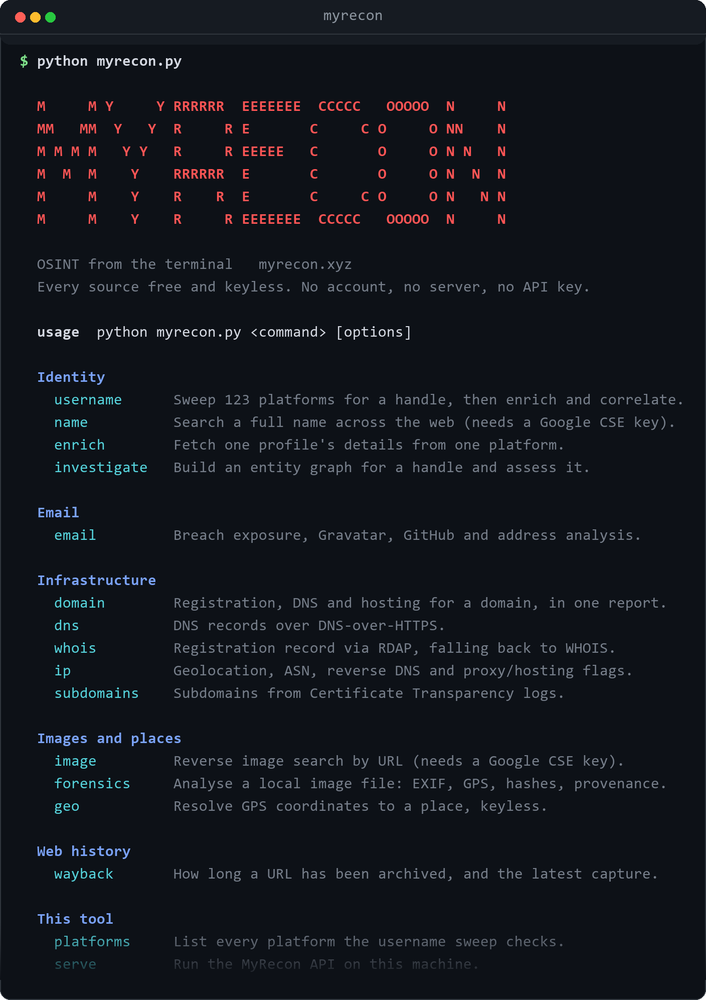
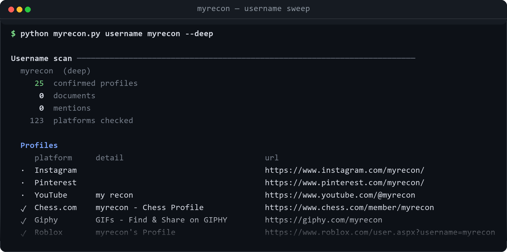
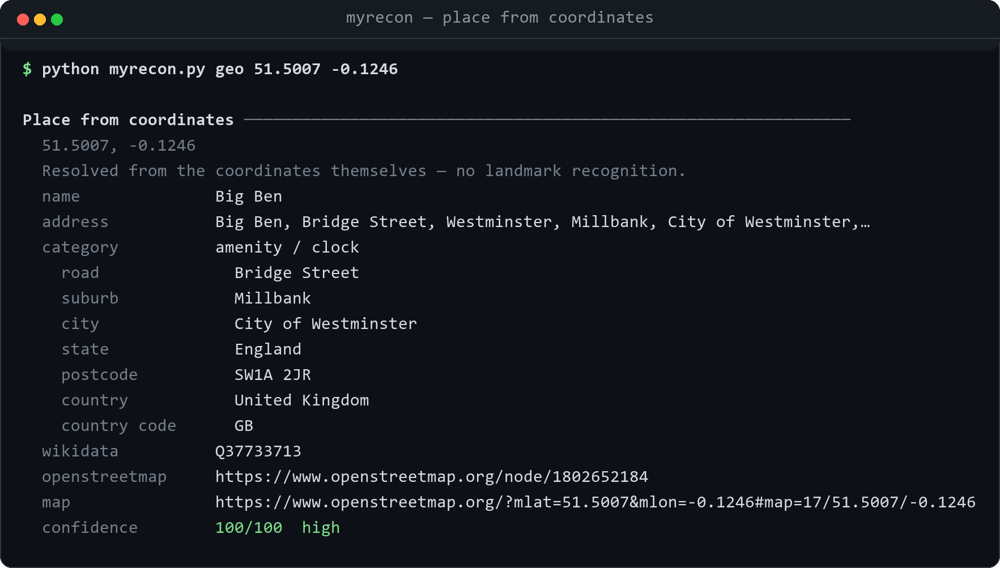

# MyRecon — OSINT Intelligence Platform

**myrecon.xyz** — a fast, accurate, privacy-respecting open-source intelligence
platform. Search usernames across **123 platforms**, analyse emails and breach
exposure, investigate domains, DNS and IP addresses, and read a photograph's own
metadata — all from free, keyless public sources.

One engine, three front doors:

```
backend/    Flask REST API      → deploy to Render     (the engine)
frontend/   Static site (SPA)   → deploy to Vercel     (myrecon.xyz)
cli/        Terminal client     → run it from a clone  (python myrecon.py)
```

The frontend never talks to third-party OSINT sources directly — it calls the
MyRecon API, which owns all validation, rate limiting, caching, and secrets. The
CLI skips the network hop entirely and calls the same service functions in
process, so a terminal answer and a myrecon.xyz answer come from one
implementation and cannot drift apart.

> **The Android app is not in this repository.** This repo is the website and
> the terminal client. The app is developed separately and is not tracked here.

<p align="center">
  
</p>

<p align="center">
  <em>Run <code>python myrecon.py</code> with no arguments for this screen.</em>
</p>

---

## Contents

- [Quick start](#quick-start)
- [What MyRecon can do](#what-myrecon-can-do)
- [The terminal client](#the-terminal-client)
- [The website](#the-website)
- [The HTTP API](#the-http-api)
- [Architecture](#architecture)
- [Configuration](#configuration)
- [Deployment](#deployment)
- [Automation](#automation)
- [Tests](#tests)
- [Security notes](#security-notes)
- [Legacy cleanup](#legacy-cleanup)

---

## Quick start

Nothing to install for the lookups themselves — the engine needs `requests`, and
`Flask` only if you want the API.

```bash
git clone https://github.com/4ryanwalia/Myrecon.git
cd Myrecon
pip install -r backend/requirements.txt
python myrecon.py username torvalds
```

Run the API and the site locally instead:

```bash
python myrecon.py serve
```

```bash
cd frontend && python -m http.server 8000
```

Then open <http://localhost:8000>. On `localhost` the frontend targets
`http://localhost:5000` automatically, and the backend's development CORS
defaults already allow the common localhost ports.

---

## What MyRecon can do

Every lookup below is free and keyless unless the table says otherwise. Nothing
requires an account, and no API key is needed to run the platform.

### Identity

| Capability | What it actually does | Where |
| --- | --- | --- |
| **Username search** | Checks **123 platforms** in parallel — the first 50 in a fast scan, all 123 with `--deep` — using per-platform validators to cut false positives, then enriches hits with avatars, bios and follower counts. Reports the platforms it checked and *rejected*, with the reason. | web, CLI, API |
| **Profile enrichment** | Fetches one profile's public detail from one platform — used when a client's own address gets refused and the server's does not. | web, CLI, API |
| **Identity correlation** | Groups accounts that share a handle into clusters with a 0–100 confidence score and the factors behind it. | web, CLI, API |
| **Investigation graph** | Builds an entity/relationship graph from a scan and writes a rule-based assessment over it. No language model is involved. | web, CLI, API |
| **Code exposure** | When a GitHub account is confirmed, reads public commit metadata for the email addresses it leaks. | web, CLI, API |
| **Full-name search** | Web search for a person's name. **Needs a Google Custom Search key.** | web, CLI, API |

### Email

| Capability | What it actually does |
| --- | --- |
| **Address analysis** | Provider and provider type, MX over DNS-over-HTTPS, deliverability, plus-addressing, disposable-address detection. |
| **Breach exposure** | Named breaches, dates, record counts and the data types exposed, with a risk band. Counts *distinct breaches*, never leaked rows. |
| **Linked accounts** | Gravatar profile, its linked accounts, and GitHub by commit email. |
| **Have I Been Pwned** | Additional breach sources. *Optional — needs `HIBP_API_KEY`.* |

### Infrastructure

| Capability | What it actually does |
| --- | --- |
| **Domain intelligence** | Registration, DNS and hosting for a domain in one report. |
| **WHOIS / RDAP** | Registrar, lifecycle dates, DNSSEC, statuses, nameservers. |
| **DNS records** | A, AAAA, MX, NS, TXT, CNAME, SOA, CAA over DNS-over-HTTPS. |
| **IP intelligence** | Geolocation, ASN and network ownership, reverse DNS, and mobile/proxy/hosting flags. |
| **Subdomains** | Enumerated from Certificate Transparency logs (crt.sh, CertSpotter). |

### Images and places

| Capability | What it actually does | Where |
| --- | --- | --- |
| **Image forensics** | Reads a local file's own bytes: EXIF, camera identity, capture settings, GPS, cryptographic hashes and three perceptual hashes, plus provenance signals stated as observations rather than verdicts. Deterministic, offline, no third party. | CLI |
| **Place from coordinates** | Resolves GPS to a named place with its address, Wikidata id, Wikipedia summary and nearby notable places. The honest substitute for landmark recognition — it reports what the coordinates say, not what a photo looks like. | CLI |
| **Reverse image search** | Finds pages carrying an image, by URL. **Needs a Google Custom Search key.** | web, CLI, API |
| **Archive history** | How long a URL has been archived and a link to the latest capture (Wayback Machine). | web, CLI, API |

### The site itself

- **Breach Files** — an article for each known breach, rebuilt from Have I Been
  Pwned every six hours by a GitHub Action and published automatically.
- **Case Files** — written investigations of major incidents.
- **Guides** — 20+ explainers: username OSINT, DNS records, SPF/DKIM/DMARC,
  WHOIS/RDAP, stealer logs, phishing, 2FA, data brokers, reducing your
  footprint, verifying a finding, and why username checkers report fake
  accounts.
- **Platform** — dark/light theme, JSON and CSV export, browser-local search
  history, live streaming progress for long scans, and honest empty states.

### Deliberately absent

No reverse-image-by-upload, OCR, landmark or logo recognition, and no face
recognition. Each needs a paid vision API or asserts identity from appearance;
the platform resolves GPS and reads metadata instead, and says so where a user
would otherwise expect the feature.

---

## The terminal client

```bash
python myrecon.py <command> [options]
python -m cli <command> [options]     # identical
```

Run it with no arguments for the command screen above; `python myrecon.py
<command> --help` documents any one command.

No server, no API key, no packaging step. Results print as a readable report;
progress goes to stderr so `--json` redirects cleanly to a file.

<p align="center">
  
</p>

<p align="center">
  <em>One handle, 123 platforms — <code>python myrecon.py username &lt;handle&gt; --deep</code></em>
</p>

### Commands

| Command | What it does |
| --- | --- |
| `username <handle>` | Sweep 123 platforms, enrich, correlate, report exposure. |
| `name "<full name>"` | Full-name web search. *Needs a Google CSE key.* |
| `email <address>` | Breach exposure, Gravatar, GitHub, address analysis. |
| `domain <domain>` | Registration, DNS and hosting in one report. |
| `dns <domain>` | DNS records over DNS-over-HTTPS. |
| `whois <domain>` | Registration record via RDAP. |
| `ip <address>` | Geolocation, ASN, reverse DNS, proxy/hosting flags. |
| `subdomains <domain>` | Subdomains from Certificate Transparency logs. |
| `enrich <platform> <user>` | One profile's details from one platform. |
| `wayback <url>` | Archive history and the most recent capture. |
| `image <url>` | Reverse image search. *Needs a Google CSE key.* |
| `forensics <path>` | Analyse a local image: EXIF, GPS, hashes, provenance. |
| `geo <lat> <lon>` | Resolve coordinates to a place, keyless. |
| `investigate <handle>` | Entity graph for a handle, with an assessment. |
| `platforms` | List every platform the sweep checks. |
| `serve` | Run the MyRecon API on this machine. |

### Options

| Flag | Effect |
| --- | --- |
| `--deep` | Wider, slower sweep. `username`, `name`, `image`. |
| `--all` | Show every row, including the platforms checked and rejected. |
| `--json` | Print the raw service result instead of a report. |
| `--quiet`, `-q` | No progress line. |
| `--color auto\|always\|never` | Colour control. `NO_COLOR` is honoured. |
| `--radius <m>` | Search radius for `geo` (default 1000 m). |
| `--host`, `--port` | Bind address for `serve`. |

Exit codes: `0` success, `1` the lookup failed, `2` bad input, `130` interrupted.

### Worked examples

```bash
python myrecon.py username torvalds --deep --all
```

```bash
python myrecon.py email someone@example.com
```

```bash
python myrecon.py forensics ./photo.jpg
```

A photo that still carries GPS prints its coordinates and the exact command to
resolve them:

```bash
python myrecon.py geo 51.5007 -0.1246
```

<p align="center">
  
</p>

Coordinates only. It reports what the GPS says, never what the picture looks
like — see [Deliberately absent](#deliberately-absent).

Pipe a scan into any JSON tool:

```bash
python myrecon.py username torvalds --json > scan.json
```

### Optional extras

`forensics` decodes images and computes DCT hashes, which needs two libraries
the API does not install:

```bash
pip install Pillow numpy
```

`name` and `image` need a Google Programmable Search key in the environment of
the machine running the scan:

```bash
export GOOGLE_API_KEY=...   # Windows: $env:GOOGLE_API_KEY="..."
export GOOGLE_CX_ID=...
```

---

## The website

```bash
cd frontend
python -m http.server 8000
```

The site is plain HTML, CSS and JavaScript with no build framework. The only
build step injects the API URL, so nothing needs compiling to work locally.

| Page | Purpose |
| --- | --- |
| `index.html` | The search app — every lookup the API exposes. |
| `deep-search.html` | Handle investigation with the graph view. |
| `breaches/` | Breach Files index and one page per breach. |
| `breaches/case-files/` | Long-form investigations. |
| `guides/` | Explainers and how-tos. |
| `services.html`, `about.html`, `founder.html`, `contact.html` | Platform pages. |
| `app.html` | The Android app's landing page. |
| `privacy.html`, `terms.html`, `cookies.html` | Policies. |

---

## The HTTP API

Every endpoint takes `POST` with a JSON body and returns
`{"status": "ok", ...}` or `{"status": "error", "code": ..., "error": ...}`.

| Endpoint | Body |
| --- | --- |
| `GET /api/health` | — |
| `POST /api/username` | `{"username": "...", "deep": false}` |
| `POST /api/username/stream` | same; responds as NDJSON progress events |
| `POST /api/investigate/stream` | `{"query": "...", "deep": false}`; NDJSON |
| `POST /api/fullname` | `{"full_name": "..."}` |
| `POST /api/email` | `{"email": "..."}` |
| `POST /api/domain` | `{"domain": "..."}` |
| `POST /api/dns` | `{"domain": "..."}` |
| `POST /api/whois` | `{"domain": "..."}` |
| `POST /api/ip` | `{"ip": "..."}` |
| `POST /api/subdomains` | `{"domain": "..."}` |
| `POST /api/image` | `{"image_url": "...", "deep": false}` |
| `POST /api/enrich` | `{"platform": "...", "username": "..."}` |
| `POST /api/wayback` | `{"url": "..."}` |

```bash
curl -X POST http://localhost:5000/api/username \
  -H "Content-Type: application/json" \
  -d '{"username":"torvalds"}'
```

Streaming endpoints emit newline-delimited JSON: `{"type":"progress",...}`
events during the scan, then `{"type":"complete","data":{...}}`.

---

## Architecture

| Concern | Where | Notes |
| --- | --- | --- |
| OSINT engines | `backend/modules/` | One module per source. No Flask imports — importable anywhere. |
| Service layer | `backend/services/` | The seam the API *and* the CLI both call. |
| Request plumbing | `backend/core/` | Validation, rate limiting, TTL cache, client IP, responses. |
| API | `backend/app.py` | Routes, CORS, caching decorators, error handlers. |
| UI | `frontend/` | HTML/CSS/JS, no framework; a tiny build step injects the API URL. |
| Terminal | `cli/` | Argument parsing and rendering only; zero lookup logic. |
| Secrets | Environment variables | Nothing is committed. See `backend/.env.example`. |

**Why split?** Vercel serverless is a poor fit for long-running, threaded
username scans; Render gives the API a real, always-warm server. Vercel gives
the static frontend a global CDN with excellent Core Web Vitals. The two
communicate over a configurable API base URL — there are no hardcoded URLs in
application code.

**Why the CLI imports instead of calling HTTP:** a terminal user already has the
engine on disk. Going through the network would add a server to run, a rate
limit to hit, and a second place for an answer to differ.

---

## Configuration

All configuration is environment variables; no secrets are ever committed.

| Variable | Default | Purpose |
| --- | --- | --- |
| `FLASK_ENV` | `production` | `development` relaxes the CORS allow-list to localhost. |
| `ALLOWED_ORIGINS` | myrecon.xyz origins | Comma-separated CORS allow-list. |
| `SECRET_KEY` | *(ephemeral)* | Set it in production before anything is signed. |
| `PORT` | `5000` | Bind port. |
| `RATE_LIMIT_ENABLED` | `true` | Per-IP limiting. |
| `RATE_LIMIT_REQUESTS` | `30` | Requests per window. |
| `RATE_LIMIT_WINDOW` | `60` | Window, in seconds. |
| `CACHE_ENABLED` | `true` | TTL response cache. |
| `CACHE_TTL` | `600` | Cache lifetime, in seconds. |
| `SCAN_MAX_WORKERS` | `20` | Sweep concurrency. |
| `REQUEST_TIMEOUT` | `10` | Per-request timeout, in seconds. |
| `MAX_BODY_BYTES` | `65536` | Request body ceiling. |
| `TRUSTED_PROXY_DEPTH` | `0` | How many `X-Forwarded-For` hops to trust. |
| `GOOGLE_API_KEY` | — | *Optional.* Full-name and reverse-image search. |
| `GOOGLE_CX_ID` | — | *Optional.* The Programmable Search engine id. |
| `HIBP_API_KEY` | — | *Optional.* Have I Been Pwned breach data. |
| `GITHUB_TOKEN` | — | *Optional.* Raises GitHub's unauthenticated rate limit. |
| `API_BASE_URL` | same-origin | *Frontend build.* The Render URL to call. |

---

## Deployment

### Backend → Render

1. New **Blueprint** (or Web Service) pointing at this repo; root directory
   `backend`. `backend/render.yaml` is a ready-to-use blueprint.
2. Start command:
   `gunicorn wsgi:app --workers 2 --threads 8 --timeout 120 --bind 0.0.0.0:$PORT`
3. Set environment variables:
   - `FLASK_ENV=production`
   - `ALLOWED_ORIGINS=https://myrecon.xyz,https://www.myrecon.xyz`
   - `SECRET_KEY` (Render can generate it)
   - Optional: `GOOGLE_API_KEY`, `GOOGLE_CX_ID`, `HIBP_API_KEY`, `GITHUB_TOKEN`
4. Health check path: `/api/health`.

### Frontend → Vercel

1. New Project; root directory `frontend`. Framework preset: **Other**.
2. Add environment variable **`API_BASE_URL`** = your Render URL, e.g.
   `https://myrecon-api.onrender.com`.
3. The build command runs four generators:
   `gen-env.js` (injects the API URL) → `build-breaches.js` →
   `build-case-files.js` → `build-sitemap.js`.
4. Point the `myrecon.xyz` domain at the Vercel project.

After both are live, make sure Render's `ALLOWED_ORIGINS` includes the exact
Vercel/custom-domain origin so CORS succeeds.

> **Changing the API host?** The new origin must also be added to `connect-src`
> in the Content-Security-Policy in `frontend/vercel.json`. The browser enforces
> that list, so an API host missing from it has every lookup blocked before the
> request leaves the page — and the only symptom is a console error.

---

## Automation

| What | Where | When |
| --- | --- | --- |
| **Breach Files** | `.github/workflows/breach-files.yml` | Every 6 hours. Rebuilds `/breaches/` from Have I Been Pwned, writes the JSON feed and sitemap entries, and commits only when something changed — which is what triggers the Vercel deploy. |
| **IndexNow** | `frontend/scripts/indexnow.js` | After a publish. Submits changed URLs to Bing, DuckDuckGo, Yandex and Seznam. Google does not participate, so this complements Search Console. |
| **Sitemap** | `frontend/scripts/build-sitemap.js` | Every build. |

---

## Tests

```bash
python -m pytest backend/tests -q
```

Covers client-IP resolution behind proxies, the network guard, and rate limiting
end to end.

---

## Security notes

- All user input is validated and sanitised server-side
  (`backend/core/validation.py`); validators raise messages that are safe to
  show a user.
- API endpoints are rate-limited per IP and protected by an origin allow-list.
- Outbound requests pass through a network guard before they are made.
- Security headers (`X-Content-Type-Options`, `X-Frame-Options`,
  `Referrer-Policy`, HSTS, CSP) are applied by both the API and Vercel.
- **Secrets live only in environment variables.**

> ⚠️ **Rotate old keys.** The pre-refactor `config.py` (see *Legacy cleanup*)
> committed live Google and SerpAPI keys in plaintext. Treat them as compromised
> and revoke/rotate them in the respective consoles.

---

## Legacy cleanup

The refactor left the original single-app/desktop code in place. It is ignored
by git and used by neither deployment, so it can be deleted whenever you are
ready:

```bash
rm -f main.py web_main.py config.py vercel.json Procfile \
      requirements.txt requirements-desktop.txt
rm -rf gui assets web modules services utils data
```

Everything the platform needs lives under `backend/`, `frontend/` and `cli/`.

---

## Using this responsibly

MyRecon reports what public sources already publish. Accounts that share a
handle are frequently unrelated people, and the platform labels them that way
rather than asserting an identity. Findings are a starting point for
verification, not a conclusion — see the guide on verifying an OSINT finding.
