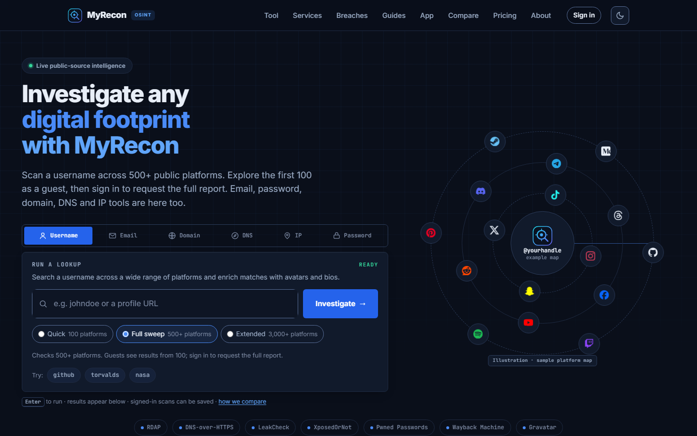
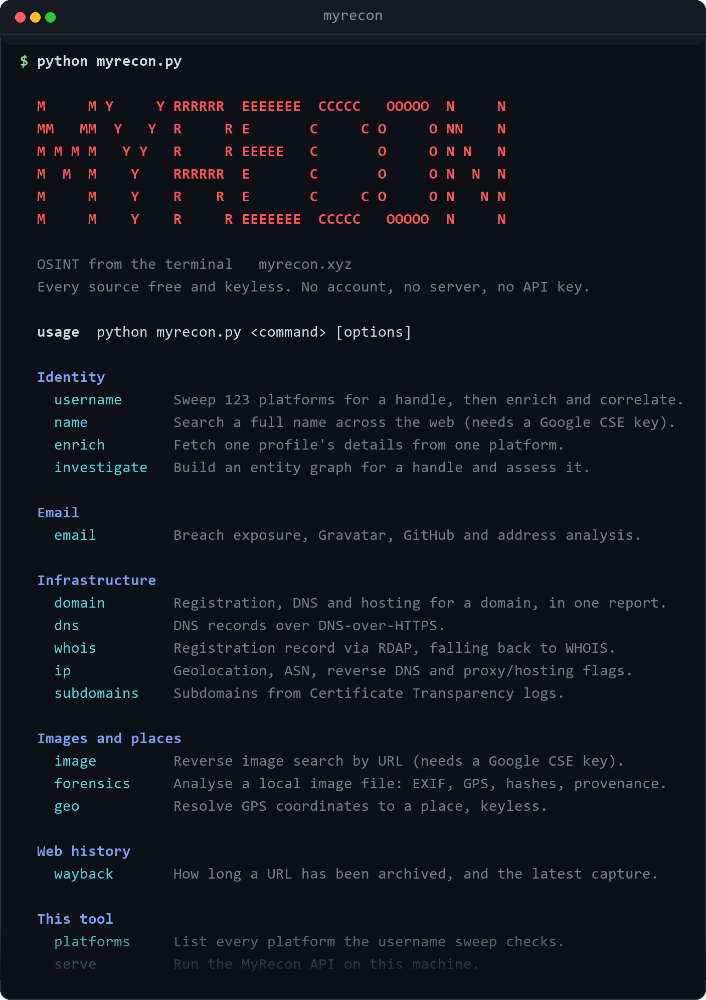

# MyRecon

**Audit your own public digital footprint with evidence you can inspect.** MyRecon brings username, email, breach, domain, DNS, and IP lookups into one web app. This repository also contains a Python CLI and the Flask API behind the site.

[Try the web app](https://myrecon.xyz) · [Run the CLI](#quick-start) · [Explore the API](#api) · [See the code](#project-layout)



MyRecon is built for self-audits and authorized research. A shared username is not proof that two accounts belong to the same person.

## Why use it?

- **Evidence-aware username results.** A platform is marked `found` only with positive evidence, `not_found` with negative evidence, and `unknown` when a block, sign-in wall, timeout, or ambiguous page prevents a conclusion. An HTTP 200 response alone does not prove an account exists.
- **One place for your exposure checks.** Explore public breach data and email signals, inspect DNS and registration records, and review IP and hosting information.
- **Use the interface that fits.** Search in the browser, run a scriptable CLI locally, or integrate with the HTTP API. The website streams scan progress and supports JSON and CSV exports.

## Quick start

Try a username lookup in the [web app](https://myrecon.xyz), or run the CLI from a clone:

```bash
git clone https://github.com/4ryanwalia/Myrecon.git
cd Myrecon
python -m pip install -r backend/requirements.txt
python myrecon.py username yourhandle
```

Replace `yourhandle` with a username you own or have permission to investigate. The CLI checks 50 platforms by default; `--deep` checks 100. It runs the shared lookup services locally, without starting the web server.

```bash
python myrecon.py username yourhandle --deep
python myrecon.py domain example.com
python myrecon.py --help
```



## What is included?

| Capability | Website | CLI | Notes |
| --- | :---: | :---: | --- |
| Username sweep and profile evidence | Yes | Yes | The website currently has 561 standard catalogue entries. The CLI checks 50 or 100. |
| Extended username sweep | Yes | No | Opt-in Pro scan across 3,166 catalogue entries, including the standard set. |
| Email and breach exposure | Yes | Yes | Checks supported public sources; source availability can vary. |
| Domain, DNS, RDAP/WHOIS, IP, and certificate-transparency subdomains | Yes | Yes | Public infrastructure data. |
| Investigation graph and profile enrichment | Yes | Yes | Relationships are leads to verify, not identity claims. |
| Local image metadata and hashes | No | Yes | Reads a local file without uploading it; install `Pillow` and `numpy` for image decoding. |
| Place lookup from GPS coordinates | No | Yes | Uses public geodata sources to describe coordinates; it does not recognize landmarks in a picture. |
| Password exposure check | Yes | No | Hashes in the browser and sends only a hash prefix to Pwned Passwords. |
| Full-name and reverse-image web search | Yes | Yes | Requires Google Programmable Search credentials. |

**Website access:** Guests can run the standard 561-entry sweep but see the first 100 platform verdicts. A signed-in free account gets one full report; Pro passes add full and Extended scan allowances. Check the [current plans](https://myrecon.xyz/pricing.html) before purchasing. Other core lookups are available without an account.

The [Android app](https://myrecon.xyz/app.html) is maintained separately; its source is not in this repository.

## How username verdicts work

| Verdict | Meaning |
| --- | --- |
| `found` | The platform returned positive account evidence, such as a user object, profile marker, or a page that differs from a known missing-user control. |
| `not_found` | The platform returned negative evidence, such as a 404/410, a missing-user message, or the same page as a known missing-user control. |
| `unknown` | The platform blocked the request or did not provide enough evidence. This includes challenges, login walls, timeouts, and ambiguous redirects. |

Network conditions and platform behaviour change. Treat results as leads and verify important findings at the source. See [how to verify an OSINT finding](https://myrecon.xyz/guides/verify-an-osint-finding.html).

## Run the website locally

Start the API and static site in separate terminals after installing the backend requirements:

```bash
python myrecon.py serve
```

```bash
cd frontend
python -m http.server 8000
```

Open [http://localhost:8000](http://localhost:8000). The local frontend uses the API on `http://localhost:5000`. Guest lookups work without account configuration; sign-in and paid plans require Firebase and payment-provider settings.

## API

The Flask API lives in [`backend/`](backend/). For example, with the API running locally:

```bash
curl -X POST http://localhost:5000/api/dns -H "Content-Type: application/json" -d '{"domain":"example.com"}'
```

Selected routes include `POST /api/username`, `POST /api/username/stream`, `POST /api/email`, `POST /api/domain`, `POST /api/dns`, `POST /api/whois`, `POST /api/ip`, and `GET /api/health`. Streaming routes send newline-delimited JSON progress and completion events. See [`backend/app.py`](backend/app.py) for the complete route list, including account and plan endpoints.

## Project layout

| Path | Purpose |
| --- | --- |
| [`backend/modules/`](backend/modules/) | Public-source lookup engines and platform verdicts. |
| [`backend/services/`](backend/services/) | Service functions shared by the API and CLI. |
| [`backend/core/`](backend/core/) | Input validation, rate limits, caching, and request controls. |
| [`frontend/`](frontend/) | Static HTML, CSS, and JavaScript for the web app, guides, and breach archive. |
| [`cli/`](cli/) | CLI commands and terminal output. |
| [`backend/tests/`](backend/tests/) | Backend tests. |

The web frontend is deployed from Vercel using [`frontend/vercel.json`](frontend/vercel.json); the API has a Render blueprint at [`backend/render.yaml`](backend/render.yaml). The site also publishes [Breach Files](https://myrecon.xyz/breaches/) and [practical guides](https://myrecon.xyz/guides/).

## Configuration and tests

Core CLI lookups need no API key. Optional integrations and hosted account features use environment variables:

| Variables | Purpose |
| --- | --- |
| `GOOGLE_API_KEY`, `GOOGLE_CX_ID` | Full-name and reverse-image web search. |
| `GITHUB_TOKEN` | Higher GitHub API rate limit for public-source lookups. |
| `FIREBASE_SERVICE_ACCOUNT`, Firebase web configuration | Sign-in and persistent web account state. |
| `RAZORPAY_KEY_ID`, `RAZORPAY_KEY_SECRET`, `RAZORPAY_WEBHOOK_SECRET` | Pro pass checkout and webhook handling. |
| `API_BASE_URL` | API origin for the hosted frontend build. |

Keep credentials out of source control. To run the backend test suite:

```bash
python -m pip install pytest
python -m pytest backend/tests -q
```

## Contributing

Focused issues and pull requests are welcome. For a platform-verdict change, include a reproducible example and explain what evidence distinguishes `found`, `not_found`, and `unknown`. Please avoid posting personal lookup results, private data, or API keys in issues. [Open an issue](https://github.com/4ryanwalia/Myrecon/issues).

If MyRecon helps you understand your footprint, [star the repository](https://github.com/4ryanwalia/Myrecon) to help others discover it.

## Security

Do not commit credentials or personal scan results. Earlier repository history included plaintext keys in a legacy configuration file. Treat those keys as compromised and rotate or revoke them; removing a file does not erase Git history.

## License

The code is released under the [MIT License](LICENSE). The MyRecon name and logo are not granted under that license. Third-party data remains subject to its providers' terms.
